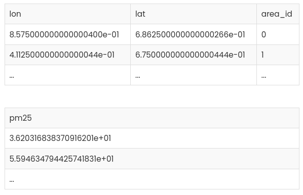
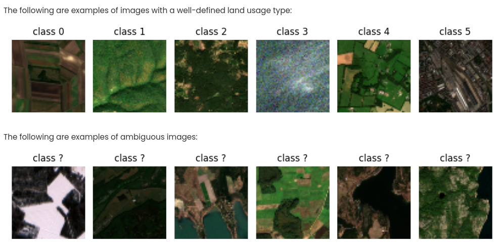
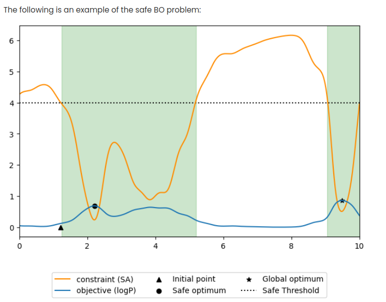
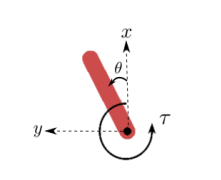

# Probabilistic Artificial Intelligence - FS2023 ETH

## Task1: Gaussian Process Regression

According to the World Health Organization, air pollution is a major environmental health issue. Hence, reducing the concentration of particulate matter (PM) in the air is an important task. 

The handout contains the data (`train_x.csv`, `train_y.csv`, `test_x.csv` and `test_y.byte`) and a solution template (`solution.py`).

2 methods needed to be implemented:

* `fit_model`

* `predict`

The training features (`train_x.csv`) are the (relative) 2D coordinates of locations on a map, along with the binary variable denoting whether that 2D point lies in a candidate residental area or not. `train_y.csv` contains the corresponding pollution measurements for each location in PM2.5⁄m3. We note that the values in `train_y.csv` contain additional measurement noise. The following is an outline of the training features

**Kernel Selection**: Extensive experimentation with various kernels and combinations revealed that a specific kernel combination (RBF + Matern + WhiteKernel) consistently produced superior predictions.

**Large Scale Learning**: One of the critical considerations in Gaussian Process regression is the computational cost of posterior inference, particularly the matrix inversion step, which scales with $O(n^3)$. To mitigate this challenge, we employed  **random undersampling of the dataset**. While alternative techniques like FITC or SoR (sums of random variables) could have been used, we found that random sampling was sufficient, given the balanced nature of the dataset. Specifically, we utilized the `sample_without_replacement` method from the `sklearn.utils.random` library, retaining up to one-third of the entire dataset for model training.

**Addressing Asymmetric Cost**: To address the issue of asymmetric costs, specifically the 50x penalty for underpredictions in potential residential zones, we introduced a heuristic. This heuristic focuses on enhancing predictions in residential areas by adding 1.1 times the Gaussian Process standard deviation to the predicted values.

## Task2: Bayesian Neural Networks (SWAG)

The task is to implement SWA-Gaussian to classify land-use patterns from satellite images, and detect ambiguous/hard images using your model's predicted confidence. For each test sample, we either output a class, or "don't know". 

In order to tackle the problem, we implemented the SWA-Gaussian method in [Maddox et al., 2019](https://arxiv.org/pdf/1902.02476.pdf) (both the SWAG-Diagonal and the FULL-Diagonal)

For further explanation on Bayesian Neural Network, see Appendix1 below.

|  |  |  |
| ---------------------------------------------------------------------------------- |:----------------------------------------------------------------------------------:| ---------------------------------------------------------------------------------- |

### Task3: Hyperparameter tuning w/ Bayesian Optimization

In this task,  we used Bayesian optimization to tune the structural features of a drug candidate, which affects its absorption and distribution. These features should be optimized subject to a constraint on how difficulty the candidate is to synthesize.

More formally, let us denote with

* $f:X→[0,1]$ the mapping from structural features to the candidate's corresponding **bioavailability** (**logP**). Given a candidate with x, we observe $y_f=f(x)+ε_f$, where $ε_f∼N(0,σ^2_f)$ is zero mean Gaussian i.i.d. noise.

* $v:X→R^+$ the mapping from structural features to the corresponding **synthetic accessiblity of a candidate** (**SA**). Similar to our objective logP, we observe a noisy value of this synthesizability score, which we denote with $$y_v=v(x)+ε_v$, with $$ε_v∼N(0,σ^2_v)$ zero mean Gaussian i.i.d. noise.

The probelm is formalized as

$$
x∗∈argmax_{x∈X,v(x)<κ} f(x)
$$

where κ is the maximum tolerated synthetic accessiblity (SA).

Below, you can find the quantitative details of this problem.

- The domain is X=[0,10]

- The noise perturbing the observation is Gaussian with standard deviation
   σf=0.15 and σv=0.0001- for logP and SA, respectively.

- The mapping f can be effectively modeled with a [Matérn](https://en.wikipedia.org/wiki/Mat%C3%A9rn_covariance_function) with smoothness parameter ν=2.5 or a [RBF](https://en.wikipedia.org/wiki/Radial_basis_function_kernel) kernel with variance 0.5, lengthscale 10, 1 or 0.5- . To achieve the best result, we recommend tuning the kernel and the lengthscale parameter.

- The mapping v can be effectively modeled with an additive kernel composed of a Linear kernel and a [Matérn](https://en.wikipedia.org/wiki/Mat%C3%A9rn_covariance_function) with smoothness parameter ν=2.5 or a [RBF](https://en.wikipedia.org/wiki/Radial_basis_function_kernel) kernel with variance √2, lengthscale 10, 1 or 0.5. And the prior mean should be 4. To achieve the best result, we recommend tuning the kernel and the lengthscale parameter.

- The maximum tolerated SA is κ=4

Acquisition functions employed:

* Upper Confidence Bound (UCB)

* Expected Improvement 

In order to beat the hard baseline, we needed to introduce the penalization term `self.af_lambda * max(mu_v - SAFETY_THRESHOLD, 0)` and to pick an estimated candidate from the GP, instead of a candidate previously explored within the 20 trials. Specifically, it favors values with higher estimated $f(x)$ when there is a high level of certainty `(norm.cdf((SAFETY_THRESHOLD - mu_v)/sigma_v) > 0.99)` that the corresponding $v(x)$ is below the defined threshold.

## Taks4: RL - Soft Actor Critic

The state of the pendulum is respresented with a three dimensional vector:

$$
x_t = [\cos(\theta_t), \sin(\theta_t), \dot\theta_t]^T
$$

We implemented the [Soft Actor-Critic: Off-Policy Maximum Entropy Deep Reinforcement Learning with a Stochastic Actor](https://arxiv.org/abs/1801.01290).

## Appendices

### Appendix1: Furhter explanation regarding BNN

To further highlight the importance of calibration in practice, consider the task of supporting doctors in medical diagnosis. Suppose that real doctors are correct in 98% of all cases while your model's diagnostic accuracy is 95%. In itself, your model is not a useful tool as the doctors do not want to incur an additional 3 percentage points of incorrect diagnoses.

Now imagine that your model is well-calibrated. That is, it can accurately estimate the probability of its predictions being correct. For 50% of the patients, your model estimates this probability at 99% and is indeed correct for 99% of those diagnoses. The doctors will happily entrust those patients to your algorithm. The other 50% of patients are harder to diagnose, so your model estimates its accuracy on the harder cases to be only 91%, which also coincides with the model's actual performance. The doctors will diagnose those harder cases themselves. While your model is overall less accurate than the doctors, thanks to its calibrated uncertainty estimates, we managed to increase the overall diagnostic accuracy (to 98.5%) and make the doctors' jobs about 50% easier. 
